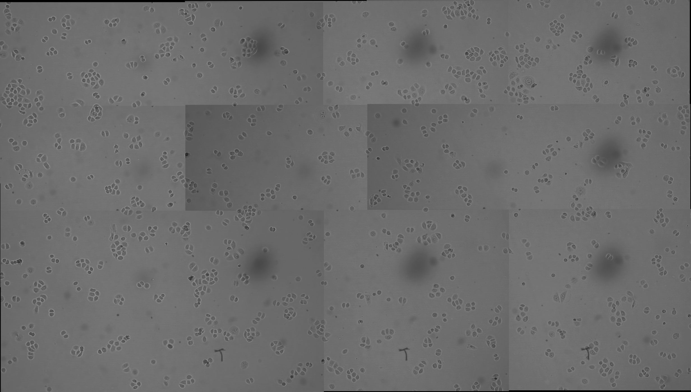

# Microscope image analysis
Basic toolbox for analyzing microscope images. Currently supports the following functionalities:
- image alignment
- image stitching
- focus stacking

## Requirements:
- Python 3
- OpenCV
- Pillow

## Supported Functionalities
### 📏 Image alignment 
- Objective: Used to align a sequence of images, to deal with camera shifts and positioning errors
- Uses the ECC algorithm for alignment. To increase tolerance for illumination changes, alignment is computed using image gradient maps.
- Can tolerate minor changes between images, but may run into issues if there are significant scene changes
- Output images are saved in a folder. Use the `--autocrop` flag to get rid of black borders around shifted images
- To run using a directory as input: `python align_images.py -i [input folder path] -o [output folder path] --autocrop`

- sample input:

- sample output:

### 🪡 Image stitching 
- Objective: Used to stitch together a 3x3 image grid., produced by a moving camera
- Assumes the following camera movement:
<pre>
        7 → 8 → 9
        ↑
        6 ← 5 ← 4
                ↑
        1 → 2 → 3
</pre>
- Requires a consistent overlap ratio. This is the `--overlap` parameter.
    - E.g. if you know the overlap is approx 30%, you can use a value between 0.25 ~ 0.3. 
    - Similarly, if you know the overlap is approximately 50%, you can use a value between 0.45 ~ 0.5. 
    - Works best when the `--overlap` parameter matches with your actual camera setup. Too high of an `--overlap` value will give the algorithm a lot of redundant information, making it harder to do keypoint matching. 
- **NOTE: If there are illumination differences between frames, the algorithm only slightly compensates for this.** I try to align the max frequency histogram bin between images. This adjusts the brightness somewhat. But to have seamless stitching, more advanced blending techniques would be needed.
- To run using a TIFF file as input: `python image_stitching.py --input [path to a .tiff file] --overlap [overlap_ratio]`
- To run using a directory as input: `python image_stitching.py --input [input folder path] --overlap [overlap_ratio]`

- sample output:

### 🥞 Focus stacking 
- Objective: Used to stack a series of images captured with different focus parameters. Each input image is only partially in focus. The goal is to assemble a single output image that pieces together the focused regions from all of the input images. 
- Designed to account for minor camera translation 
- To run using a TIFF file as input: `python focus_stacking.py --input [path to a .tiff file]`
- To run using a directory as input: `python focus_stacking.py --input [input folder path]`

- sample input:

- sample output:

